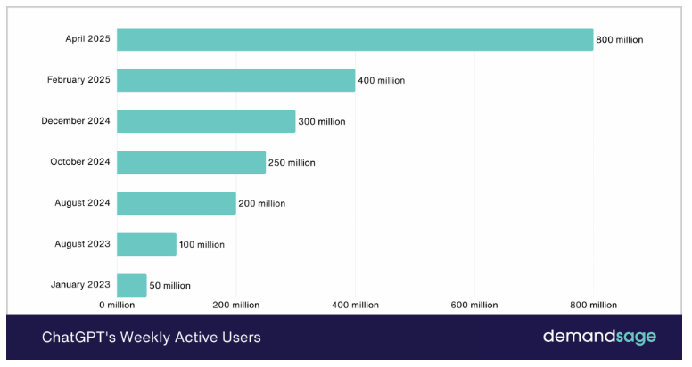
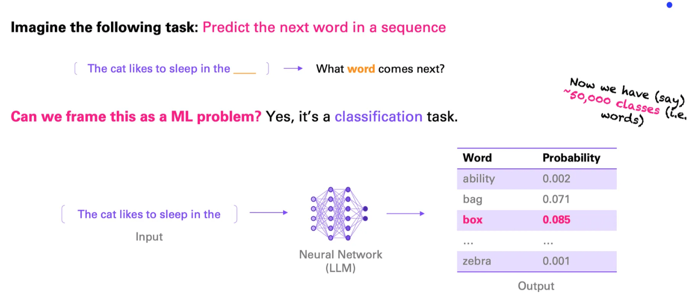
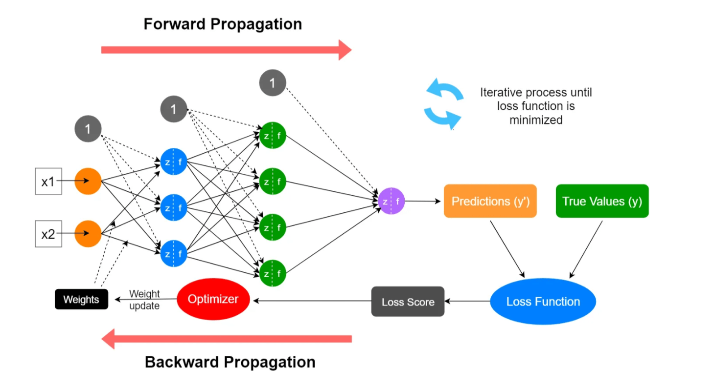
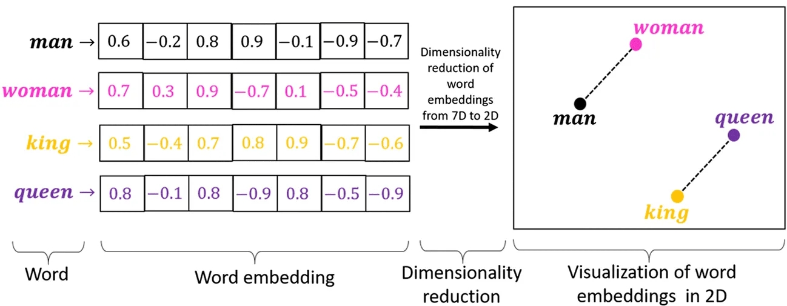
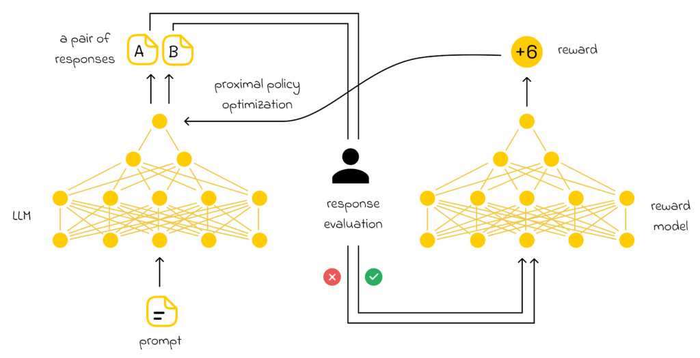
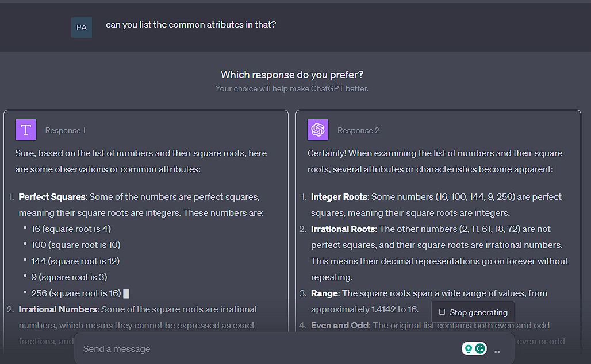
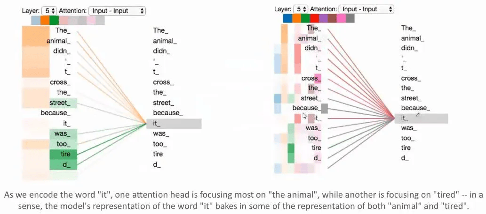
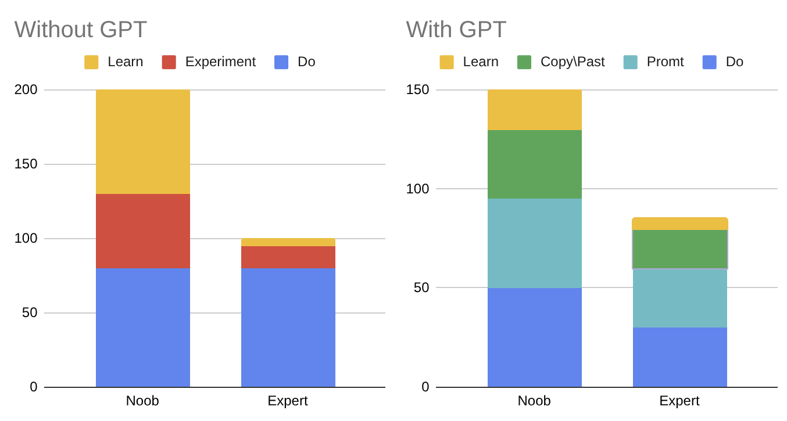

On 30 November 2022, ChatGPT, the product of OPENAI, saw the light of day, and it was my first “really conscious” technology drift of my life. I experienced both the rise of social networks and the spread of fast internet connections, but at the time, I was too young to have a before-and-after comparison.

This time, it was different. I was completing my Master's degree, and my last few years were quite similar (learning, studying, trying, doing other stuff-ing, completing exams), so I have a clear comparison of tasks influenced by this tool. To be honest, at the beginning it was a great tool for writing, summarizing, and generating Q\&A for my mock exams. It was not a good programmer, though. But it solved a lot of boring stuff about my student life.

I started to use it. Recognizing this change in my behavior, I started to keep an eye on what other people were doing regarding the topic. In the first moment, I noticed that ChatGPT initially appealed mostly to technical students, the ones interested not only in the outcome, but also in new tech tools. Not too much time passed before most of the screens on my university library PCs were showing a dark-background chat with a LLM model. Meanwhile, peers with a different background did not show much interest in the topic. In less than a year, ChatGPT became the chatty version of Facebook. People of all ages and backgrounds believe that most of the stuff in their life could be shared with it to have feedback and a suggestion. Some find it the only way to solve text-based tasks, and another part believes it is just more bullshit from modern kids. Anyway, it became an everyday topic and tool.  

<!-- ChatGPT users chart from this [demandsage.com](https://www.demandsage.com/chatgpt-statistics/) that has lots of others stats -->

Back to my personal experience, I was not immune to this. Right now, I always have a tab open in my browser pointing to the same LLM, and it helps me with writing emails, writing code, generating images, finding cooking recipes for me, and so on… **It is my personal assistant**. At the moment, the free version of most systems is good enough for me, and I don’t feel it’s necessary to subscribe to a more powerful one. I have very contrasting feelings about how this tool influenced my productive life, and I would like to  try to build a publicly committed **"fair use" set of rules**. 

But before legislating on a topic (as expected from any act of regulation) a full understanding of the subject is needed.

*ED. Note: In this text, I have used a "you"-based communication style, but everything said obviously reflects my own behavior and intentions. But, for the sake of beauty, a "we"-based communication was not the best fit.*

# What is a LLM

The core functionality of ChatGPT is based on Machine Learning. Machine Learning (ML) is a subfield of Artificial Intelligence that specifically focuses on pattern recognition in data. As you can imagine, o**nce you recognize a pattern, you can apply that pattern to new observations**. That’s the essence of the idea. The most powerful tool in the ML field is deep learning, which exploits neural networks to find that patterns in big amounts of data. 

The use of these techniques in the field of **Natural Language Processing (NLP)** allows to create a Large Language Model (LLM), which is a particular kind of neural network model that is used to “predict” the next word in a sentence. Iterating over this process, we can build up complex texts starting from a user input.

<!--  LLMs framing problem from this [article](https://medium.com/data-science-at-microsoft/how-large-language-models-work-91c362f5b78f)  -->

Of course, the neural network is trained using human-generated text to learn what should be the “most probable” word that should be used to fill the blank space. For a usable solution, we need this probability to be as precise as possible, and to do so we need loOoOoots of data, coming from any sort of human text artifact like books, blog posts (sigh\!), movie scripts, social posts…

At the end of the day, **we have by design a system that has no thinking, learning, information or perception system, but “just” a word prediction system.** Even if this is just a word prediction system, it is incredibly effective in practice when we try to ask for some kind of help, and this is astonishing. But it leaves me with many doubts about the potential of this kind of system.

I would like to explore those doubts and recognize that this tool modifies our behavior, but first, I would feel incomplete without a paragraph where I go a bit deeper into how these kinds of systems work.

## A (hopeful  brief) technical explanation 

Let’s be honest, this part is a bit out of scope compared to the topic of this note. But, in the end, I'm still an engineer, and this is my blog, so a seemingly useless technical part explaining how things work has to be there.

Feel free to skip this part; it is not necessary to understand the point of the article. At the same time, if you are mildly interested in the topic, but not enough to read a few hundred keystrokes, I suggest this short video: [*Large Language Models Explained Briefly*](https://www.youtube.com/watch?v=LPZh9BOjkQs&list=WL&index=11), for a better visual understanding of the topic.

Anyway, a good way to explore and navigate the point is **breaking down the GPT acronym**, which stands for **G**enerative-**P**retrained-**T**ransformer. We can go quickly over the meaning of *generative* (used to generate stuff) and start to focus on the second term instead. As I already said, this kind of chats are based on the ability of a model to predict the next words in an incomplete text. But how do they do it?

### On Model and (Pre)Training

It’s no secret that, at the end of the day, most of ChatGPT’s underlying system is based on a neural network. Deep Neural Networks are a computational model formed by an interconnected group of nodes, inspired by a simplified model of biological neurons \[[Wikipedia](https://en.wikipedia.org/wiki/Neural_network)\]. Each node typically transforms its input using a non-linear function called **an activation function** (99% of the time, it’s [ReLU](https://en.wikipedia.org/wiki/Rectifier_\(neural_networks\))), and each connection has a weight used to transform the output of a node before it is passed to the next layer of nodes.

The training typically consists of “showing” the neural network an input, letting it predict the corresponding output, and then computing the error between the predicted and real output using a [loss function](https://en.wikipedia.org/wiki/Loss_function). The quantitative error is used to “correct” the weights of each connection to try to minimize the error between predicted and real output in the long run. This method is called [**backpropagation**](https://en.wikipedia.org/wiki/Backpropagation).

By iterating over the datasets (lots of samples are needed), we are able to use the network to approximate the function that links input with output (any kind of function: i.e. one that maps an image to 1 or 0 depending on whether a dog is present in the image).

<!-- Illustration of backpropagation training system -->

> The Universal Approximation Theorem states that a neural network with a single hidden layer containing a sufficient number of neurons can approximate any continuous function, given a suitable activation function.  
> \-George Cybenko

Roughly, the same process is used to produce our **Large Language Model**, which is a model built with **lots** of neurons and is used to predict the next words in a sentence.

The composition of the dataset is quite straightforward: **any sequence of text can serve as a valid sample** (e.g., *a cat is on the table*). The sequence is truncated and given as input (*a cat is on ...*), and the missing **word** is used as the output (*table*).

At this point, a question naturally comes to mind: following the training step, we have to compute quantitatively the error between the network output (which, at the beginning, is a pseudo-random word) and the real missing word (*table*) in a quantitative way. But how is this done? There is a branch of Natural Language Processing that studies how to map words to numbers, trying to **capture the semantic and syntactic meaning of words in context,** and to find a “mathematical distance” that is meaningful between words (e.g., the distance between *man*\-*woman* should be similar to that between *king*\-*queen*). This branch is called **word embedding**.

If you're interested, [this article](https://medium.com/@harsh.vardhan7695/a-comprehensive-guide-to-word-embeddings-in-nlp-ee3f9e4663ed) presents the most common approaches to do this, from the simplest to the most effective ones. But what’s important is that this step is indeed performed.

<!-- A cutted images from [this article](https://medium.com/@hari4om/word-embedding-d816f643140) to visually explain word embedding  -->

Of course, this method is used not only for loss computation but also to pre-process each sentence in the dataset, so that, in the end, the neural network has to deal only with numbers.

Returning to our main thread, that is, the meaning of GPT: *P* stands for Pre-trained (Neural Network). This is because the step described above is only the first part of the process of training a functional chat model, and typically this part is reused across different iterations or types of chatbot (it’s like the pizza base).

Let’s list the complete recipe:

- **Self-Supervised Learning:** this is the process where we take a **HUGGGGE** amount of text and train the model to predict the next word in randomly selected text, as explained before. In this step, the “knowledge” of the model is embedded, because being exposed to lots of content modify the network’s weights, allowing the model to more likely produce the correct text if the answer has already been seen by the model (just like if you take the same test twice, the chances of getting a better score are higher).  
- **Fine-Tuning**: now the algorithm has an approximate working sentence-completing function, but there is a drawback in the previous stage. Because a very large amount of data is needed, quality wasn’t always guaranteed, so the algorithm could have learned something totally irrelevant (e.g., it could answer with a random disclaimer found at the bottom of many documents in the dataset). To solve this problem, a new round of learning is done, starting from the previous weights and with a lower impact on them (just a fine-tune), using an extremely high-quality (and expensive) dataset, validated by humans to remove corner cases and guide the model toward more human-like conversation. If needed, the dataset could contain specific data on which we want the model to be “an expert.”   
- (Optional) **Reinforcement Learning from Human Feedback (RLHF):** An additional step is used to better align the behavior of the model with the human thinking system. The method consists of **giving a ranking to different answers generated by the model and adjusting the model to optimize for this ranking**. The scores for each answer are computed using a model, called **a reward model**, that ranks the text based on human feedback on past responses. Of course, having this human feedback is quite expensive, and it should be validated to ensure alignment with human morals, that is another reason why this step is performed. The scoring system is quite similar to the Elo system used in various competitive ranking environments. This feedback system is then used in [reinforcement learning](https://en.wikipedia.org/wiki/Reinforcement_learning) as a reward signal to improve the model’s performance.  

<!-- Representation of the ranking and rewarding system from [this article](https://towardsdatascience.com/explained-simply-reinforcement-learning-from-human-feedback/).  -->
    
  You have probably seen the data collection phase of this training step, when ChatGPT presents you with two different answers and you need to choose the most appropriate one. 

<!-- An example of double choice to collect human feedback in ChatGPT  -->
    

### Transformer 

Ok, but we should go deeper into the concept of models. Of course, the model is not a simple neural network; it includes more complex components. One of the most impactful innovations was introduced by Google in the paper *"[Attention Is All You Need](https://arxiv.org/abs/1706.03762)"*. This paper must be cited for the impact it has had on the industry.

Before the introduction of the **attention mechanism**, when generating text, at some point the first part of the context used to generate the following words would be forgotten (e.g., only the last 400 characters of the text are used to generate the next words). Now, with attention, the model is able to retain all useful information, keeping only what it learns to be important, by focusing attention on it.

<!-- A representation of “attention”: how impactful is the input for output prediction.  -->

The process to train this mechanism is quite similar to the prediction process, but with the focus on optimizing the model's understanding of the input to enhance the prediction. (Of course, even this process is simplified for the reader, but understanding the concept is the most important thing)

# On its use 

Here we come to the core of this note, which is meant to find a rationale, a **philosophy for a fair and meaningful usage of these models.**

I start this section with one assumption: whenever you start using any of the AI-powered chatbots, you are fascinated by their power and begin delegating the most boring tasks to them. The next step is to use them as a search engine, assuming they are correct. Then comes the tipping point: **for everything you do, you first check if the LLM can solve it for you. If after some iterations, you are not satisfied with the result, you, tired and frustrated, finally start thinking about how to solve the problem yourself**.

This way of acting could be a problem, not only for the current task you are meant to do, but also for the long run, limiting your ability to find a solution to problems, eliminating the search of different sources for comparison, limiting your exposure to new stuff and the process of elaborate something useful but that has to be adapted to your situation. All this missing process leads the user to a sort of mental fatigue and laziness that could be problematic for the long run. 

Don’t misunderstand me, I’m a supporter of these tools, or in general, any new technology. I’d like to integrate them into a typical knowledge worker’s workflow, confident that they can improve productivity and free people from low-value-added tasks. But I also believe this should be done in a conscious and effective way, especially in the long run.

That’s why this note has a few more paragraphs\!

## Not assume them to be right (used)

Especially if you have followed the “brief” technical explanation, ChatGPT-like models will no longer seem like intelligent beings, but rather a long and complex mathematical and statistical process. I hope this perspective helps you (and me) use them more rationally. 

**The most important thing that a user must keep in mind is that they are just a proxy for the next words, they don't have reasoning power.** With this in mind, it’s clear that a user should never fully trust any information coming from the system, especially when the task or question requires logical reasoning rather than simple information retrieval. Of course, not all the information we use needs to be highly accurate, so it’s up to you to judge when a fact check is really valuable.

Even when we just need to retrieve and manipulate information (e.g., summarizing a text), we cannot assume that chatbots have all the information we need, especially if that information decays over time (e.g., shop opening hours). **You cannot assume the system is omniscient and up to date**. A lot of uncommon information is missing from the training set, or, even if present, it might not be properly ingested by the model. If we assume that the given answer is correct and complete we risk losing valuable information, which can lead to misunderstandings and missing key aspects of the topic. This can prevent us from gaining a broader understanding, and in the best case, result in a short, unchecked, and limited answer.  

Each source of information, if taken alone, can give a partial view of reality. The danger here is that you typically do not find a source that directly answers your specific question, so you need to adapt and integrate multiple ones. This time is different: **these tools try to generate an answer that feels as satisfying as possible**, with no aim of **completeness or accuracy**.

To be honest, the idea that these systems know how to answer every question is also influenced by the fact that they are quite unable to respond “I don’t know”, or to admit when information is missing. Instead, they tend to invent a plausible-sounding solution, but when tested, proves to be completely incorrect. This phenomenon is known as **hallucination**, and we have to learn how to deal with it. One of the most common reasons for hallucination is that, in the training dataset, you rarely find documents where the author says they don’t know something, or surveys where many responses are simply “I don’t know.” Who would ever write a document like that? And, keeping in mind that the engine behind these systems is essentially a **probabilistic text completer**, based on knowledge acquired from previously analyzed text, it doesn’t have the capacity to simply say, *“Sorry, I don’t know the answer.”* Even because that kind of response would require a level of reasoning that goes well beyond predicting the next word. 

If you do not check the answer, you will start to trust a system that seems to know all the answers, without hesitation, until the test day comes…

## Their impact on us 

Since now we’ve analyzed the limitations of the tool, but not those of the user, and, to be honest, many of the issues actually come from the users themselves (us). Starting from a more rational point of view, one of the main risks in using GPTs is the laziness users can develop by constantly relying on the system to solve textual tasks.

Until now, technology has mostly impacted “muscle-driven” tasks, where humans were quite limited and allowed us to unleash our mental power in more impactful ways. First of all, in terms of scale, physical tasks are not easily scalable (e.g. if moving one stone requires one person, then moving three stones typically requires three people) and an automatic system can dramatically multiply productivity in a way that human labor alone cannot. And when a task becomes a commodity, we often lose the ability to perform it ourselves, or the process changes so much that it no longer resembles how a human would do it, making it difficult to learn again. To be honest, I’ve personally lost the ability to walk long distances without shoes, build a shelter, or scavenge for food, and I’m fine with that. In general, I wouldn't say that this process has reduced humanity's well-being.

The ability to generate text that is understandable to others, to acquire data and information, process it, find solutions to specific problems, be creative, or **simply sustain prolonged mental effort are the very capabilities that allowed Homo sapiens to thrive on Earth.** These activities don’t suffer from issues of scalability, and they’re extremely hard to replace with something better. Mental capabilities can’t simply be replaced, or even meaningfully trained. We cannot create a gym for mental training without putting something in practice in the real world. 

If you'll allow me a bit of hyperbole: these systems have so far used knowledge generated by human beings. If we stop exploring complex topics and generating new knowledge through deep thinking, can we really say we’re making progress? And even if progress continues, can we be sure it’s leading to a better version of humanity? After this dystopian philosophical digression, let’s come back down to earth and look at something more tangible.

The aspect of human cognitive limitation is the loss of mental fatigue, or more precisely, the **loss of situations that produce it**, which is typically what drives learning, skill acquisition, or the improvement of existing abilities.

<!-- Effort spent to solve a task with and without LLMs  -->

The process of learning **i**mplies, after acquiring the necessary theoretical foundations, a period of **deliberate practice**, something that helps the skill stick in our minds and makes it more tangible. But let’s be honest: doing something outside our comfort zone is hard, and it makes us feel like idiots. We only do it when we must and we’d never do it if someone (or something) could do it for us.

**That’s the critical point: we’ve begun asking GPTs not to explain how to do things, but to do them for us, gradually losing control of the creation process.**

Even if we produce something new this way, we won’t be able to repeat it. In reality, all you did was delegate. This is especially problematic for juniors, who miss out on the struggle and the tools that experience builds on the path to becoming experts. These experiences are often traded away for the illusion of saving time  and for the sake of laziness.

I would like to analyze “one more thing”. I would like to suggest you [not say thanks to chatGPT](https://futurism.com/altman-please-thanks-chatgpt), not only from an energy consumption point of view, but also because it’s not a human being and doesn’t follow social rules like humans do. This isn’t a rant about [extreme edge cases](https://www.theguardian.com/technology/2022/jun/12/google-engineer-ai-bot-sentient-blake-lemoine), but a warning alert for humans' tendency to anthropomorphize things, especially in this context. **It shouldn’t be considered normal to assign morality, feelings, or intentions to a probability distribution**. When we do that, we begin to change our behavior in response to these systems, attributing to them abilities they simply do not possess. On the other hand, this phenomenon can even raise moral barriers around non-existent entities, potentially slowing down the development of new technologies.

**Use GPT as a powerful tool,  not as an expert human being.**

## But they works 

I can write lots of other words that try to persuade someone to use GPTs, but the reality is that wherever you give them some unstructured, badly descriptive, mixed-language task with wrong grammar, it completes it, almost every time, and we cannot deny it. I tried it on my skin. And to be honest, performing a task, when you know it can be completed with little or no effort, is not tricky to consider. And this is why here I would like to formalize when I use it, how I use it, and how I would like to use it to find the best balance between performance, laziness and learning. 

### Proofreader

Currently, it happens to me to write some text, for different reasons and in different contexts: email writing, study notes, todos, bureaucratic documents and so on… and it is quite boring, especially when a corporate-like speaking is required. In this case, to be honest, I typically write the core concept and forward it to the magic tool, sometimes with some additional meta-data about how the text should sound and the parts to highlight, other times with just an “improve this text” prompt. Of course, grammar and lexical errors will be corrected, and I’m quite happy with it. Probably, if I stuck with doing this kind of job, I could improve my performance in corporate-speaking and formal writing, but to be honest, at least at this moment, I really don’t get the point of investing energy in it.

What I would like to pay attention to and avoid doing is letting the GPTs enrich the text with some other information, transform the meaning of my writing, or help me to brainstorm what to do with that stuff. This is my task, and it is the stuff in which I believe I can give more value and be impactful, especially in the long run.My intention is to avoid letting the tool “respond to this mail” or “write this document for me”. It has no meaning; it keeps it “on the same path” as everything else and doesn't let me diverge onto a new creative path. So even if it could solve the problem in the short term, it kills me over the long run. So, on my path, this feature is disallowed. It is not a valuable trade-off for my growth.

### Coding &  Software

I have contrasting feelings about coding with GPTs. I consider it the most skilled junior software engineer in the world. In my use, I have seen that if you ask it a defined, short task, with little or no integration with something else (like the development of a short function), it works — and it works f\*cking well. Probably the training set is filled with LeetCode-like code, with lots of coding best practices and so on. At the same time, when you have to deal with uncommon bugs deriving from systems integration, or develop something that doesn’t have to be perfect itself but has to work really well in a complex system, the pain starts — especially if you have to let it repeat the task due to some hallucination. The probability of losing time and energy trying to debug, re-prompt, highlight the bugs, and integrate the generated code into the codebase can exponentially increase.

But we have to talk about the elephant in the room: how to handle generated code? First of all, a review of the code is needed, and in theory, a plagiarism check is necessary… Anyway, if you didn't study and design the system, how could we be sure that the code is optimal or at least looks good? An exploration of some of the possible solutions with some deep thinking on the task is still needed to judge the code, and typically it is the most time-consuming part of programming and it is still necessary to judge the work. So, if we want to really do the job, not just do a monkey copy-paste, we still need a huge amount of mental energy and time. In practice, the trade-off is typically: delegate the task to GPTs and cross your fingers that it works, like a black box: losing the learning, mental-gym, and confidentiality part of the task. Sometimes, we can almost talk about technical debt of generated code. Or perform the task by yourself, investing time, but at the same time running on the computer science learning path.

After this brief overview, the conclusion is that in this kind of work, if you have just to complete the job in the most trivial way possible (i.e. some script that you have to run once) and nothing can be learned from it, GPT could be one of your best friends. In other contexts, it is not valuable to use this kind of tools intensively, when effectively saved, the effort saved is not so valuable with respect to the quality given or, from a personal point of view, the lost possibility of sharpening your coding skills.

An interesting way to use it is to let these tools analyze your code to give feedback on the produced code, to have an “expert” feedback on what has been produced, or just a different point of view, that can enrich your coding experience. A AI-Rubber duck 🦆.

You can find many excellent articles on this topic on the [Antirez blog](https://antirez.com). If you're looking for a good starting point, or simply a reference to previous work, I recommend [this article](https://antirez.com/news/154).

### BrainStorming and Information Retrieval 

Linked to the last lines, I really like to use GPTs as a sort of brainstorm. It happens quite often that I need to retrieve information about a topic, or some technical information about something that I have to do. For complex stuff, the process is typically the following: start to search about the topic, highlight the important stuff, search about them, repeat until satisfied. With this process in mind, asking GPTs for some information about the topic, some side questions that I have, or just “this is what I know about X, am I missing something?” Let me double-check my assumptions and beliefs, or give another perspective on the topic. It is extremely useful for side questions — stuff that is related to a topic but in reality is not really that topic, but a variation of it. Here I can retrieve information that has to be verified of course, and perspectives that cannot simply be searched on Google, where usually you can find a more “pure” topic analysis.

From this perspective, I have no regrets about using it. I introduced a new tool into my search toolbox, that not only gives me information, but there is a probabilistic distribution of reassessment of words and improves the fitting of information with my goal. This gives me more confidence **in** the theme, absorbing and analyzing a different way of approaching stuff that is always valuable, without the effort to ask another human expert. Whenever I have some thoughts like “Ok, so if this is how X works, if I perform Y I expect Z”, and have a second (but always to be verified) opinion, that even if wrong can enrich my mental model of that stuff. “An idea has not to be correct to lead to something valuable\!”

Of course, GPTs cannot be the only source of truth, but can be a really good topic summary and information organization tool. And like any other tool, whenever you depend on it to continue with your work, it can become dangerous.

# On Ai Agent

AI agents are software systems that use artificial intelligence to autonomously perform tasks on behalf of users, with a focus on achieving specific goals. To be honest, in this snippet of text, I don’t want to go deep into how they work; just know that you can allow LLMs to call some programmatic function (i.e., to surf the internet) and then rearrange the text in a programmatic format (like JSON, XML,...) to programmatically do something.

Honestly, they seem to work at the moment, but I don’t know how it is possible to rely on the fact that they will give a well-formatted JSON at output, or the fact that it doesn’t hallucinate, and the fact that they are not quite deterministic, so even testing is not a sound process for them.

<!-- Just a meme  -->

But still, they work, and whenever you don’t need pharma-reliability, they can do the job. This note is starting to take a bit too long for me to write, this is not so in focus. But I really like to cite them as the “next step” in the worlds of LLMs for the sake of completeness, and to be honest, they seem to be promising, in case any of you would like to delve deeper into the topic.
